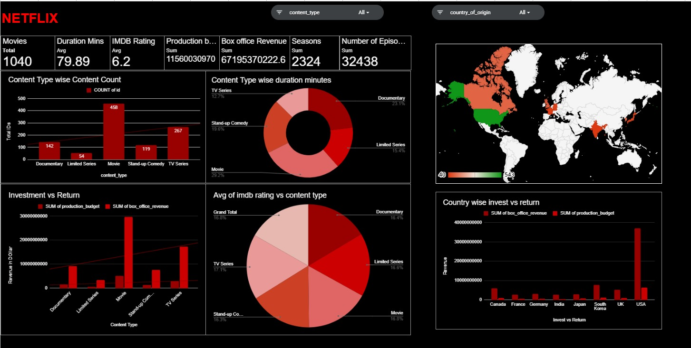

# 🎬 Movies Data Analysis Dashboard
Interactive Movies Data Analysis Dashboard using MS Excel with Investment vs Return insights.
---

## 1. Project Title
Movies Data Analysis Using MS Excel 

---

## 2. Project Overview

This project focuses on analyzing a Movies dataset to uncover meaningful insights about movie performance, audience preferences, and industry trends. The dataset includes information such as movie titles, genres, directors, release years, ratings, revenue, runtime, and audience votes.

The primary objective of this project is to transform raw movie data into actionable insights through data cleaning, pivot analysis, and interactive dashboard visualization.

Through this analysis, the project aims to:

Identify the most popular and most profitable movie genres

Analyze rating trends over different years

Examine the relationship between movie ratings and revenue

Determine the top-performing movies and directors

Understand overall industry growth patterns

The final dashboard presents key metrics and visual insights in a clear and interactive format, enabling better understanding of movie industry performance and audience behavior.
---

## 3. File Details

- **Raw Dataset Folder**
  - Movies.csv (Original dataset file)

- **Cleaned Dataset Folder**
  - Movies_cleaned.xlsx (Data after cleaning and preprocessing)

- **Pivot Tables and Calculations Folder**
  - Movies_pivot_analysis1.xlsx (Contains pivot tables and calculated metrics)
  - Movies_pivot_analysis2.xlsx (Contains pivot tables and calculated metrics)

- **Dashboard Folder**
  - Dashboard of netflix.jpg (Dashboard screenshot)

---

## 4. Data Dictionary

The following table describes each variable used in the Movies dataset:

| Column Name            | Data Type | Description |
|------------------------|-----------|------------|
| id                     | Integer   | Unique identifier assigned to each movie or TV show |
| title                  | Text      | Name of the movie or TV series |
| content_type           | Text      | Type of content (Movie, TV Series, Limited Series, etc.) |
| genre_primary          | Text      | Main genre/category of the content |
| genre_secondary        | Text      | Secondary genre of the content (if applicable) |
| release_year           | Integer   | Year the content was released |
| duration_minutes       | Integer   | Total runtime in minutes |
| rating                 | Text      | Content certification rating (e.g., PG, R, TV-MA) |
| language               | Text      | Primary language of the content |
| country_of_origin      | Text      | Country where the content was produced |
| imdb_rating            | Decimal   | IMDb rating score (scale 0–10) |
| production_budget      | Decimal   | Budget spent on production |
| box_office_revenue     | Decimal   | Revenue generated at the box office |
| number_of_seasons      | Integer   | Number of seasons (applicable for TV series) |
| number_of_episodes     | Integer   | Total number of episodes (applicable for TV series) |
| is_netflix_original    | Boolean   | Indicates whether the content is a Netflix original (TRUE/FALSE) |
| added_to_platform      | Date      | Date the content was added to the streaming platform |
| content_warning        | Boolean   | Indicates presence of content warning (TRUE/FALSE) |

---

## 5. Cleaning Notes

The following preprocessing steps were performed on the dataset:

- The `movie_id` column contained values in the format (e.g., movie_001).
- Extracted the numeric portion of the ID for better structure and consistency.
- Removed the original `id` column after extraction.
- Sorted the dataset for better organization and readability.
- Verified column headers and ensured consistent formatting.

No major data transformation or advanced cleaning was required.

---

## 6. Analytics View

The dashboard provides the following analytical insights:

- Total Content Count (Movies, TV Series, etc.)
- Average Duration (in minutes)
- Average IMDb Rating
- Total Production Budget
- Total Box Office Revenue
- Total Number of Episodes
- Total Number of Seasons

### Visual Analysis Includes:

- Content Type Wise Content Count
- Content Type Wise Duration Distribution
- Average IMDb Rating by Content Type
- Investment vs Return Analysis (Production Budget vs Box Office Revenue)
- Country Wise Investment vs Return Comparison
- Global Content Distribution Map by Country of Origin

---

## 7. Dashboard Image

---

## 8. Analysis Report

The dashboard analysis highlights clear trends in content distribution and financial performance across different content types and countries.

Movies represent the highest share of total content, followed by TV Series and Stand-up Comedy. Movies also contribute the largest portion of total box office revenue and production investment.

The Investment vs Return analysis shows that Movies generate significantly higher box office returns compared to other content types, indicating strong profitability. TV Series contribute substantially in terms of total seasons and episodes, reflecting long-term audience engagement.

The average IMDb rating across content types remains relatively consistent, suggesting balanced audience reception across formats.

Country-wise analysis indicates that the USA leads in both production budget and box office revenue, making it the dominant market in the dataset. Other countries such as the UK, South Korea, and India also show notable contributions.

Overall, the analysis demonstrates a strong relationship between production investment and box office performance, particularly in Movies.
---

## 9. Conclusion

This project demonstrates how structured data analysis and visualization can uncover meaningful insights from entertainment industry data.

The analysis shows that Movies dominate in terms of revenue generation and overall investment, while TV Series contribute significantly through higher numbers of seasons and episodes. The Investment vs Return comparison highlights a strong positive relationship between production budget and box office revenue.

Country-wise insights reveal that the USA leads in content production and revenue, indicating its dominant position in the industry. The average IMDb ratings across content types suggest relatively consistent audience satisfaction.

Overall, the dashboard provides a comprehensive view of content distribution, financial performance, and global trends. It can support strategic decision-making in content production, investment planning, and market analysis.
